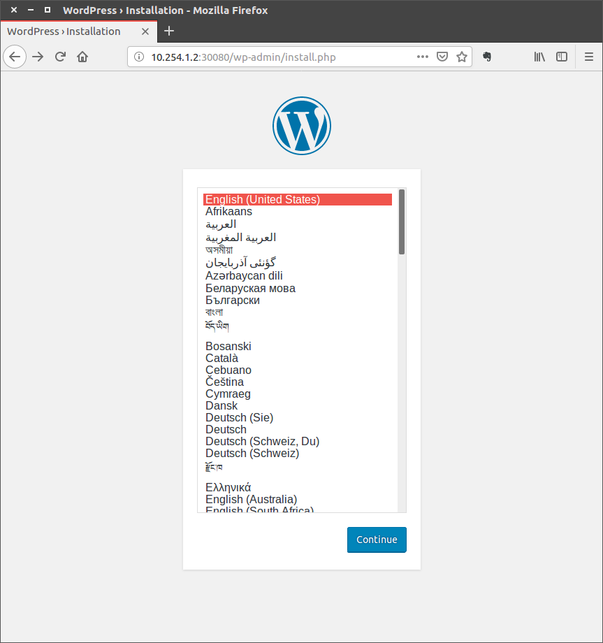
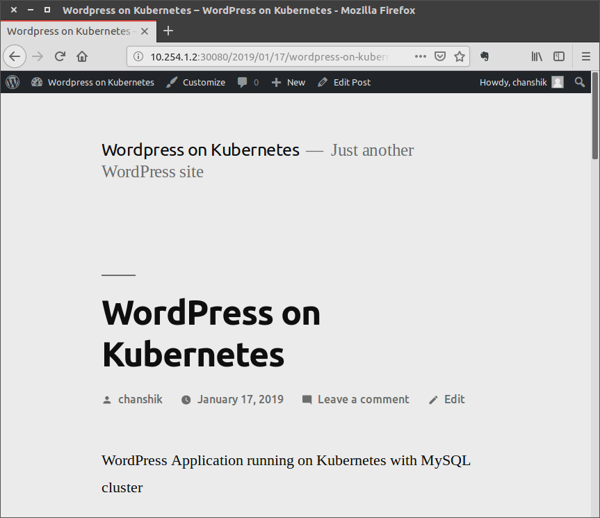

# Setup mysql-operator Hands-on

**mysql-operator** 를 이용해 **Kubernetes** 환경 위에 **MySQL** 클러스터를 배포해보겠습니다.

* Vagrant 와 Virtualbox 를 이용해 Kubernetes 클러스터 구축
* helm 설치 및 권한 설정
* mysql-operator 설치
* MySQL 클러스터 구축
* Wordpress 설치


# Environments

- Host OS: Ubuntu 16.04
- Guest OS: Ubuntu 16.04 (ubuntu/xenial64) / 18.04 (ubuntu/bionic64)
- Automation Tool: Vagrant
- Virtual Machine Provider: Virtualbox


## Install Virtualbox

사용하는 운영체제에 맞는 패키지를 받아 설치합니다.

- https://www.virtualbox.org/wiki/Downloads

```bash
sudo apt install virtualbox
```


## Install Vagrant 

VM 을 생성하면서 기본적인 초기화를 진행할 때 사용할 Vagrant 프로그램을 설치합니다.

- https://www.vagrantup.com/downloads.html

```bash
sudo dpkg -i vagrant_2.2.3_x86_64.deb
```


## Downloads worksheet

github 저장소에 실습을 진행하면서 사용할 파일을 디렉토리별로 구분하여 저장해두었습니다.

```bash
git clone https://github.com/chanshik/mysql-operator-hands-on.git
cd mysql-operator-hands-on
mysql-operator-hands-on$ 
```


## VM Networks

VM 에 할당한 IP 와 역할은 다음과 같습니다.

| Node        | IP         | Role   | Labels    |
| ----------- | ---------- | ------ | --------- |
| k8s-mysql-1 | 10.254.1.2 | Master |           |
| k8s-mysql-2 | 10.254.1.3 | Worker | app=mysql |
| k8s-mysql-3 | 10.254.1.4 | Wokrer | app=mysql |


## Start VMs

미리 작성해둔 `Vagrantfile` 을 이용해 VM 3대를 시작합니다. 사용하는 장비 사양에 맞도록 CPU, 메모리를 지정합니다.

```ruby
# -*- mode: ruby -*-
# vi: set ft=ruby :

Vagrant.configure("2") do |config|
  config.vm.box = "ubuntu/bionic64"
  config.vm.box_check_update = false
  node_subnet = "10.254.1"

  (1..3).each do |i|
    config.vm.define "k8s-mysql-#{i}" do |node|
      node.vm.hostname = "k8s-mysql-#{i}"
      node.vm.network "private_network", ip: "#{node_subnet}.#{i + 1}"

      node.vm.provider "virtualbox" do |vb|
        vb.name = "k8s-mysql-#{i}"
        vb.gui = false

        vb.cpus = 2
        vb.memory = "2048"
      end

      node.vm.provision "bootstrap", type: "shell", inline: <<-SHELL
        sudo curl -s https://packages.cloud.google.com/apt/doc/apt-key.gpg | sudo apt-key add -
        sudo bash -c 'cat <<EOF >/etc/apt/sources.list.d/kubernetes.list
deb http://apt.kubernetes.io/ kubernetes-xenial main
EOF'
        sudo apt update
        sudo apt install -y docker.io kubelet kubeadm kubectl
        sudo usermod -aG docker vagrant
        sudo systemctl enable docker.service

        sudo sed -i '/k8s/d' /etc/hosts
        sudo echo "#{node_subnet}.#{i + 1} k8s-mysql-#{i}" | sudo tee -a /etc/hosts
      SHELL
    end
  end
end
```

앞에서 작성한 **Vagrantfile** 을 이용해 VM 을 생성합니다.

```bash
vagrant up
```

VM 생성이 모두 끝난 다음에 ssh 를 실행하여 원하는 노드에 접속합니다.

```bash
vagrant ssh k8s-mysql-1
```


# Setup Kubernetes Cluster

## Select pod network add-on

Kubernetes 에서 사용할 CNI (Container Network Interface) 선택하고 `kubeadm` 을 이용해 초기화 할 때 같이 지정합니다. 실습에서는 **Calico** CNI 를 사용합니다.

- kubeadm 은 CNI 기반 네트워크만 지원
- Calico CIDR: 192.168.0.0/16
- https://kubernetes.io/docs/concepts/cluster-administration/addons/


## Initialize master node

Master node 에서 `kubeadm init` 명령을 실행하여 클러스터 초기화 작업을 시작합니다.

```bash
sudo swapoff -a
sudo kubeadm init --pod-network-cidr=192.168.0.0/16 --apiserver-advertise-address=10.254.1.2

[init] Using Kubernetes version: v1.13.2
[preflight] Running pre-flight checks
[preflight] Pulling images required for setting up a Kubernetes cluster
[preflight] This might take a minute or two, depending on the speed of your internet connection
[preflight] You can also perform this action in beforehand using 'kubeadm config images pull'

...

Your Kubernetes master has initialized successfully!

To start using your cluster, you need to run the following as a regular user:

  mkdir -p $HOME/.kube
  sudo cp -i /etc/kubernetes/admin.conf $HOME/.kube/config
  sudo chown $(id -u):$(id -g) $HOME/.kube/config

You should now deploy a pod network to the cluster.
Run "kubectl apply -f [podnetwork].yaml" with one of the options listed at:
  https://kubernetes.io/docs/concepts/cluster-administration/addons/

You can now join any number of machines by running the following on each node
as root:

  kubeadm join 10.254.1.2:6443 --token 4mdqmi.2aggafwub1xfx7wv --discovery-token-ca-cert-hash sha256:a90675799fa2c0c610fc774bce9737328b9326f58582fa5d6af1276fdf68ff1f
```


## Add nodes

Master node 초기화 이후에 Worker 노드에서 `kubeadm join` 명령을 실행합니다.

**@k8s-2**

```bash
sudo swapoff -a
sudo kubeadm join 10.254.1.2:6443 --token 4mdqmi.2aggafwub1xfx7wv --discovery-token-ca-cert-hash sha256:a90675799fa2c0c610fc774bce9737328b9326f58582fa5d6af1276fdf68ff1f
```

**@k8s-3**

```bash
sudo swapoff -a
sudo kubeadm join 10.254.1.2:6443 --token 4mdqmi.2aggafwub1xfx7wv --discovery-token-ca-cert-hash sha256:a90675799fa2c0c610fc774bce9737328b9326f58582fa5d6af1276fdf68ff1f
```


## Export KUBECONFIG

생성한 Kubernetes 클러스터를 관리하기 위해 `/etc/kubernetes/admin.conf` 파일이 필요합니다. 홈 디렉토리에 복사하고 소유자를 변경한 이후에 `KUBECONFIG` 환경변수에 위치를 지정합니다.

```bash
sudo cp /etc/kubernetes/admin.conf ./k8s-admin.conf
sudo chown vagrant:vagrant k8s-admin.conf 
export KUBECONFIG=/home/vagrant/k8s-admin.conf
echo "export KUBECONFIG=/home/vagrant/k8s-admin.conf" >> .bashrc
kubectl get nodes

NAME          STATUS     ROLES    AGE    VERSION
k8s-mysql-1   NotReady   master   24m    v1.13.2
k8s-mysql-2   NotReady   <none>   106s   v1.13.2
k8s-mysql-3   NotReady   <none>   64s    v1.13.2
```


## Install CNI

`kubectl get nodes` 명령 결과를 보면 **STATUS** 가 현재 **NotReady** 입니다. 초기화 단계에서 선택한 CNI 를 설치해야 실제로 사용 가능한 상태가 됩니다.

**Calico** CNI 를 사용하기 위해 `kubectl` 명령어를 이용해 설치합니다. 

```bash
kubectl apply -f https://docs.projectcalico.org/v3.3/getting-started/kubernetes/installation/hosted/rbac-kdd.yaml

clusterrole.rbac.authorization.k8s.io/calico-node created
clusterrolebinding.rbac.authorization.k8s.io/calico-node created
```

```bash
kubectl apply -f https://docs.projectcalico.org/v3.3/getting-started/kubernetes/installation/hosted/kubernetes-datastore/calico-networking/1.7/calico.yaml

configmap/calico-config created
service/calico-typha created
deployment.apps/calico-typha created
poddisruptionbudget.policy/calico-typha created
daemonset.extensions/calico-node created
serviceaccount/calico-node created
customresourcedefinition.apiextensions.k8s.io/felixconfigurations.crd.projectcalico.org created
customresourcedefinition.apiextensions.k8s.io/bgppeers.crd.projectcalico.org created
customresourcedefinition.apiextensions.k8s.io/bgpconfigurations.crd.projectcalico.org created
customresourcedefinition.apiextensions.k8s.io/ippools.crd.projectcalico.org created
customresourcedefinition.apiextensions.k8s.io/hostendpoints.crd.projectcalico.org created
customresourcedefinition.apiextensions.k8s.io/clusterinformations.crd.projectcalico.org created
customresourcedefinition.apiextensions.k8s.io/globalnetworkpolicies.crd.projectcalico.org created
customresourcedefinition.apiextensions.k8s.io/globalnetworksets.crd.projectcalico.org created
customresourcedefinition.apiextensions.k8s.io/networkpolicies.crd.projectcalico.org created
```

```bash
kubectl get nodes
NAME          STATUS   ROLES    AGE     VERSION
k8s-mysql-1   Ready    master   27m     v1.13.2
k8s-mysql-2   Ready    <none>   4m42s   v1.13.2
k8s-mysql-3   Ready    <none>   4m      v1.13.2
```


## Master isolation

Kubernetes 기본 설정은 Master 역할을 하는 노드에 다른 컨테이너를 배포하지 않도록 되어있습니다. Master 노드도 Worker 노드로 사용하기 위해서는 아래 명령을 실행해 설정을 변경합니다.

```bash
kubectl taint nodes --all node-role.kubernetes.io/master- 

node/k8s-mysql-1 untainted
taint "node-role.kubernetes.io/master:" not found
taint "node-role.kubernetes.io/master:" not found
```


# Setup Helm

**Helm** 은 **Kubernetes Package Manager** 로서 어플리케이션을 구성하는 여러 컴포넌트를 패키지로 묶어서 쉽게 배포하고 관리할 수 있게 도움을 줍니다.

mysql-operator 를 클러스터에 설치할 때 helm 을 이용합니다.


## Install helm

```bash
curl https://raw.githubusercontent.com/helm/helm/master/scripts/get | bash

  % Total    % Received % Xferd  Average Speed   Time    Time     Time  Current
                                 Dload  Upload   Total   Spent    Left  Speed
100  7236  100  7236    0     0   1188      0  0:00:06  0:00:06 --:--:--  1581
Downloading https://kubernetes-helm.storage.googleapis.com/helm-v2.12.2-linux-amd64.tar.gz
Preparing to install helm and tiller into /usr/local/bin
helm installed into /usr/local/bin/helm
tiller installed into /usr/local/bin/tiller
Run 'helm init' to configure helm.
```


## Create service account

helm 에서 사용할 Service Account 를 생성합니다.

**helm/rbac-config.yaml**

```yaml
---
apiVersion: v1
kind: ServiceAccount
metadata:
  name: tiller
  namespace: kube-system

---
apiVersion: rbac.authorization.k8s.io/v1
kind: ClusterRoleBinding
metadata:
  name: tiller
roleRef:
  apiGroup: rbac.authorization.k8s.io
  kind: ClusterRole
  name: cluster-admin
subjects:
  - kind: ServiceAccount
    name: tiller
    namespace: kube-system
```

```bash
kubectl create -f helm/rbac-config.yaml 

serviceaccount/tiller created
clusterrolebinding.rbac.authorization.k8s.io/tiller created
```


## Update repository

설치한 helm 을 초기화하고 **stable** 패키지 리스트를 가져옵니다.

```bash
helm init --service-account tiller

Creating /home/vagrant/.helm
Creating /home/vagrant/.helm/repository
Creating /home/vagrant/.helm/repository/cache
Creating /home/vagrant/.helm/repository/local
Creating /home/vagrant/.helm/plugins
Creating /home/vagrant/.helm/starters
Creating /home/vagrant/.helm/cache/archive
Creating /home/vagrant/.helm/repository/repositories.yaml
Adding stable repo with URL: https://kubernetes-charts.storage.googleapis.com
Adding local repo with URL: http://127.0.0.1:8879/charts
$HELM_HOME has been configured at /home/vagrant/.helm.

Tiller (the Helm server-side component) has been installed into your Kubernetes Cluster.

Please note: by default, Tiller is deployed with an insecure 'allow unauthenticated users' policy.
To prevent this, run `helm init` with the --tiller-tls-verify flag.
For more information on securing your installation see: https://docs.helm.sh/using_helm/#securing-your-helm-installation
Happy Helming!
```

```bash
helm repo update

Hang tight while we grab the latest from your chart repositories...
...Skip local chart repository
...Successfully got an update from the "stable" chart repository
Update Complete. ⎈ Happy Helming!⎈
```


# Setup mysql-operator

MySQL 클러스터를 구축할 때 사용할 mysql-operator 는 이미 다양한 버전이 존재합니다. 여기에서는 Oracle 에서 배포하고 있는 https://github.com/oracle/mysql-operator 를 사용하겠습니다.


## Create namespace

mysql-operator 를 배포할 Namespace 를 먼저 생성합니다.

```bash
kubectl create namespace mysql-operator

namespace/mysql-operator created
```


MySQL 클러스터를 배포할 `database`  Namespace 도 미리 생성해둡니다.

```bash
kubectl create namespace database

namespace/database created
```


## Installing mysql-operator

helm 을 이용해 mysql-operator 를 설치하기 위해 github 저장소 안에 있는 Helm Chart 파일들이 필요합니다.

필요한 Chart 파일은 https://github.com/oracle/mysql-operator/tree/master/mysql-operator 디렉토리에 있기  때문에 일반적인 상황에서는 mysql-operator 저장소를 `git clone` 으로 받아 사용하면 됩니다.

여기에서는 전체 저장소를 다 받을 필요가 없도록 설치에 필요한 파일들을 미리 받아두었습니다.

```bash
helm install --name mysql-operator mysql-operator/mysql-operator

NAME:   mysql-operator
LAST DEPLOYED: Wed Jan 16 16:16:47 2019
NAMESPACE: default
STATUS: DEPLOYED

RESOURCES:
==> v1/ServiceAccount
NAME            SECRETS  AGE
mysql-operator  1        0s
mysql-agent     1        0s

==> v1beta1/CustomResourceDefinition
NAME                                   AGE
mysqlrestores.mysql.oracle.com         0s
mysqlbackupschedules.mysql.oracle.com  0s
mysqlclusters.mysql.oracle.com         0s
mysqlbackups.mysql.oracle.com          0s

==> v1beta1/ClusterRole
NAME            AGE
mysql-operator  0s
mysql-agent     0s

==> v1beta1/ClusterRoleBinding
NAME            AGE
mysql-agent     0s
mysql-operator  0s

==> v1beta1/Deployment
NAME            DESIRED  CURRENT  UP-TO-DATE  AVAILABLE  AGE
mysql-operator  1        1        1           0          0s

==> v1/Pod(related)
NAME                             READY  STATUS             RESTARTS  AGE
mysql-operator-67c769b7c8-lbvjh  0/1    ContainerCreating  0         0s


NOTES:
Thanks for installing the MySQL Operator.

Check if the operator is running with

kubectl -n mysql-operator get po
```

설치된 것을 확인해봅니다.

```bash
kubectl -n mysql-operator get po -w

NAME                              READY   STATUS    RESTARTS   AGE
mysql-operator-67c769b7c8-lbvjh   1/1     Running   0          78s
```


# Deploy MySQL Cluster

mysql-operator 를 이용해 MySQL 클러스터를 구축할 때 필요한 설정을 미리 준비합니다.


##  my.cnf ConfigMap

MySQL 서버에서 사용할 my.cnf 파일을 ConfigMap 으로 생성해둡니다. mysql-operator 에서 기본적으로 설치하는 MySQL 버전은 8.x 버전입니다. 여기에서는 Legacy Password 를 사용하기 위해 `default_authentication_plugin=mysql_native_password` 옵션을 지정하였습니다.

**mysql/mysql-config.yaml**

```yaml
apiVersion: v1
kind: ConfigMap
metadata:
  name: mysql-config
  namespace: database
data:
  my.cnf: |-
    [mysqld]
    default_authentication_plugin=mysql_native_password
    skip-host-cache
    skip-name-resolve
```

```bash
kubectl create -f mysql/mysql-config.yaml

configmap/mysql-config created
```


## Setup root password

MySQL 서버에서 사용할 root 계정 패스워드를 Secret 객체로 생성합니다.

Secret 객체를 생성하는 방법으로 YAML 파일을 이용하거나 `kubectl` 명령을 이용할 수 있습니다.


YAML 파일을 이용하기 위해서는 사용할 패스워드를 `base64` 로 변환한 값을 미리 생성해두는 것이 필요합니다.

```bash
echo -n "mysqlpass" | base64

bXlzcWxwYXNz
```

생성한 값을 `password` 항목에 복사하고 `kubectl` 명령으로 `Secret` 객체를 생성합니다.


**mysql/mysql-password.yaml**

```yaml
apiVersion: v1
kind: Secret
metadata:
  name: mysql-root-password
  namespace: database
type: Opaque
data:
  password: bXlzcWxwYXNz
```

```bash
kubectl create -f mysql/mysql-password.yaml

secret/mysql-root-password created
```


`kubectl` 명령을 이용해 직접 값을 생성하는 방법은 `--from-literal` 옵션을 이용합니다.

```bash
kubectl create secret generic mysql-root-password --from-literal=password="mysqlpass" -n database

secret/mysql-root-password created
```

`--from-literal` 옵션을 이용해 패스워드를 지정할 때, 특수문자를 사용한다면 Escape 문자를 이용해야 합니다.

> Note:
>
> Special characters such as `$`, `\*`, and `!` require escaping. If the password you are using has special characters, you need to escape them using the `\\` character. For example, if your actual password is `S!B\*d$zDsb`, you should execute the command this way:
>
> ```
> kubectl create secret generic dev-db-secret --from-literal=username=devuser --from-literal=password=S\\!B\\\*d\\$zDsb
> ```
>
> You do not need to escape special characters in passwords from files (`--from-file`).

https://kubernetes.io/docs/concepts/configuration/secret/#use-case-pods-with-prod-test-credentials 


## Add label to worker nodes

전체 노드 중에 MySQL 클러스터에 참여할 노드를 Label 을 붙여 제한해보겠습니다.

```bash
kubectl label nodes k8s-mysql-2 k8s-mysql-3 app=mysql

node/k8s-mysql-2 labeled
node/k8s-mysql-3 labeled
```

```bash
kubectl get nodes --show-labels

NAME          STATUS   ROLES    AGE    VERSION   LABELS
k8s-mysql-1   Ready    master   111m   v1.13.2   beta.kubernetes.io/arch=amd64,beta.kubernetes.io/os=linux,kubernetes.io/hostname=k8s-mysql-1,node-role.kubernetes.io/master=
k8s-mysql-2   Ready    <none>   88m    v1.13.2   app=mysql,beta.kubernetes.io/arch=amd64,beta.kubernetes.io/os=linux,kubernetes.io/hostname=k8s-mysql-2
k8s-mysql-3   Ready    <none>   88m    v1.13.2   app=mysql,beta.kubernetes.io/arch=amd64,beta.kubernetes.io/os=linux,kubernetes.io/hostname=k8s-mysql-3
```


## Install MySQL cluster

MySQL 서버에서 사용할 저장소를 생성합니다.

**mysql/mysql-pv.yaml**

```yaml
apiVersion: v1
kind: PersistentVolume
metadata:
  labels:
    type: local
  name: mysql-volume-0
spec:
  accessModes:
  - ReadWriteMany
  capacity:
    storage: 5Gi
  hostPath:
    path: /tmp/data1
  persistentVolumeReclaimPolicy: Recycle
  storageClassName: manual
  
---
apiVersion: v1
kind: PersistentVolume
metadata:
  labels:
    type: local
  name: mysql-volume-1
spec:
  accessModes:
  - ReadWriteMany
  capacity:
    storage: 5Gi
  hostPath:
    path: /tmp/data2
  persistentVolumeReclaimPolicy: Recycle
  storageClassName: manual
```

```bash
kubectl create -f mysql/mysql-pv.yaml 

persistentvolume/mysql-volume-0 created
persistentvolume/mysql-volume-1 created
```


MySQL 클러스터를 관리할 mysql-agent 를 배포합니다.

**mysql/mysql-agent.yaml**

```yaml
apiVersion: v1
kind: ServiceAccount
metadata:
  name: mysql-agent
  namespace: database
---
kind: RoleBinding
apiVersion: rbac.authorization.k8s.io/v1beta1
metadata:
  name: mysql-agent
  namespace: database
roleRef:
  apiGroup: rbac.authorization.k8s.io
  kind: ClusterRole
  name: mysql-agent
subjects:
- kind: ServiceAccount
  name: mysql-agent
  namespace: database
```

```bash
kubectl create -f mysql/mysql-agent.yaml

serviceaccount/mysql-agent created
rolebinding.rbac.authorization.k8s.io/mysql-agent created
```


mysql-operator 를 이용해 MySQL 클러스터를 생성합니다.

**mysql/mysql-cluster.yaml**

```yaml
apiVersion: mysql.oracle.com/v1alpha1
kind: Cluster
metadata:
  name: mysql-cluster
  namespace: database
spec:
  members: 2
  rootPasswordSecret:
    name: mysql-root-password
  config:
    name: mysql-config
  nodeSelector:
    app: mysql
  volumeClaimTemplate:
    metadata:
      name: data
    spec:
      storageClassName: manual
      accessModes:
        - ReadWriteMany
      resources:
        requests:
          storage: 2Gi
```

```bash
kubectl create -f mysql/mysql-cluster.yaml

cluster.mysql.oracle.com/mysql-cluster created
```


배포된 MySQL 클러스터 상태를 확인해보겠습니다.

```bash
kubectl get mysqlcluster -n database

NAME            AGE
mysql-cluster   3m
```

```bash
kubectl get po -n database

NAME              READY   STATUS    RESTARTS   AGE
mysql-cluster-0   2/2     Running   0          4m58s
mysql-cluster-1   2/2     Running   0          4m22s
```


제대로 설치되었는지 `mysql-client` 를 이용해 확인해보겠습니다.

```bash
kubectl run mysql-client --image=mysql:5.7 -it --rm --restart=Never -- mysql -h mysql-cluster.database -uroot -pmysqlpass

If you don't see a command prompt, try pressing enter.

mysql> show databases;
+-------------------------------+
| Database                      |
+-------------------------------+
| information_schema            |
| mysql                         |
| mysql_innodb_cluster_metadata |
| performance_schema            |
| sys                           |
+-------------------------------+
5 rows in set (0.00 sec)
```


 ## Primary / Secondary

생성한 MySQL 클러스터는 `Master` / `Secondary` 역할을 가지고 실행되고 있습니다. `Master` 역할을 하는 Pod 은 데이터를 읽고 쓰는 것이 모두 가능하지만, `Secondary` 역할을 하는 Pod 에 접속하면 읽기만 가능합니다. 

어느 Pod 이 `Master` 역할을 하는지는 Pod 이 가진 `Label` 을 확인하여 구분할 수 있습니다.

```bash
kubectl get po -n database --show-labels

NAME              READY   STATUS    RESTARTS   AGE     LABELS
mysql-cluster-0   2/2     Running   0          7m48s   ... v1alpha1.mysql.oracle.com/role=primary, ...
mysql-cluster-1   2/2     Running   0          7m12s   ... v1alpha1.mysql.oracle.com/role=secondary, ...
```

`v1alpha1.mysql.oracle.com/role` `Label` 을 확인하면 어느 Pod 이 `Master` 역할을 하고 있는지 볼 수 있습니다.


## Create service for external access

Kubernetes 클러스터 내부에서는 `mysql-cluster.database` 주소를 이용해 MySQL 서버에 접속하는 것이 가능합니다. 외부에서도 MySQL 서버를 이용할 수 있도록 `Service` 를 추가해보겠습니다.

**mysql/mysql-master-svc.yaml**

```yaml
apiVersion: v1
kind: Service
metadata:
  labels:
    v1alpha1.mysql.oracle.com/cluster: mysql-cluster
  name: mysql
  namespace: database
spec:
  ports:
  - port: 3306
    protocol: TCP
    targetPort: 3306
    nodePort: 30306
  selector:
    v1alpha1.mysql.oracle.com/cluster: mysql-cluster
    v1alpha1.mysql.oracle.com/role: primary
  type: NodePort
```

```bash
kubectl create -f mysql/mysql-master-svc.yaml -n database

service/mysql created
```

```bash
kubectl get svc -n database

NAME            TYPE        CLUSTER-IP       EXTERNAL-IP   PORT(S)          AGE
mysql           NodePort    10.104.197.207   <none>        3306:30306/TCP   20s
mysql-cluster   ClusterIP   None             <none>        3306/TCP         124m
```


Kubernetes 클러스터 외부에서 접속하여 보겠습니다.

```bash
mysql -h 10.254.1.2 -P 30306 -uroot -pmysqlpass

mysql: [Warning] Using a password on the command line interface can be insecure.
Welcome to the MySQL monitor.  Commands end with ; or \g.
Your MySQL connection id is 534
Server version: 8.0.12 MySQL Community Server - GPL

Copyright (c) 2000, 2018, Oracle and/or its affiliates. All rights reserved.

Oracle is a registered trademark of Oracle Corporation and/or its
affiliates. Other names may be trademarks of their respective
owners.

Type 'help;' or '\h' for help. Type '\c' to clear the current input statement.

mysql> show databases;
+-------------------------------+
| Database                      |
+-------------------------------+
| information_schema            |
| mysql                         |
| mysql_innodb_cluster_metadata |
| performance_schema            |
| sys                           |
+-------------------------------+
5 rows in set (0.00 sec)
```


# Install Wordpress

MySQL 서버를 이용해 Wordpress 를 설치하고 사용해보도록 하겠습니다.

먼저 MySQL 서버에 접속할 때 사용할 비밀번호를 Secret 객체로 생성합니다.

**wordpress/wordpress-mysql-password.yaml**

```yaml
apiVersion: v1
kind: Secret
metadata:
  name: mysql-password
type: Opaque
data:
  password: bXlzcWxwYXNz
```

```bash
kubectl create -f wordpress/wordpress-mysql-password.yaml 

secret/mysql-password created
```


Wordpress 컨테이너를 배포할 때 앞에서 생성한 비밀번호를 참조하도록 지정합니다.

그리고 Wordpress 컨테이너가 MySQL 클러스터와는 다른 노드에 할당되도록 `nodeSelector` 설정을 지정하였습니다.

세 개 노드 중에 1번 노드에 컨테이너가 배포될 것입니다.


**wordpress/wordpress-deploy.yaml**

```yaml
apiVersion: extensions/v1beta1
kind: Deployment
metadata:
  name: wordpress
  labels:
    app: wordpress
spec:
  template:
    metadata:
      labels:
        app: wordpress
    spec:
      nodeSelector:
        kubernetes.io/hostname: k8s-mysql-1
      containers:
      - name: wordpress
        image: wordpress:5.0.3-apache
        env:
        - name: WORDPRESS_DB_HOST
          value: mysql.database
        - name: WORDPRESS_DB_USER
          value: root
        - name: WORDPRESS_DB_PASSWORD
          valueFrom:
            secretKeyRef:
              name: mysql-password
              key: password
        ports:
        - containerPort: 80

```


```bash
kubectl create -f wordpress/wordpress-deploy.yaml 

deployment.extensions/wordpress created
```

```bash
kubectl get po -o wide

NAME                        READY   STATUS    RESTARTS   AGE     IP            NODE 
wordpress-775ffcd46-57t88   1/1     Running   0          3m10s   192.168.0.3   k8s-mysql-1
```


외부에서 접속할 수 있도록 `Service` 객체를 생성합니다.

**wordpress/wordpress-svc.yaml**

```yaml
apiVersion: v1
kind: Service
metadata:
  name: wordpress
  labels:
    app: wordpress
spec:
  ports:
    - port: 80
      nodePort: 30080
  selector:
    app: wordpress
  type: NodePort
```


```bash
kubectl create -f wordpress/wordpress-svc.yaml 

service/wordpress created
```

```bash
kubectl get svc

NAME         TYPE        CLUSTER-IP      EXTERNAL-IP   PORT(S)        AGE
kubernetes   ClusterIP   10.96.0.1       <none>        443/TCP        20h
wordpress    NodePort    10.106.245.55   <none>        80:30080/TCP   27s
```


NodePort 로 지정한 페이지에 들어가 Wordpress 설치를 계속 진행할 수 있습니다.




# MySQL High Availability Test

MySQL 클러스터 중에 `Master` 역할을 하는 Pod 이 갑자기 종료되는 경우에도 `Secondary` Pod 을 통해 서비스를 계속 할 수 있는지 테스트를 해보겠습니다.

먼저 어느 Pod 이 `Master` 역할을 하고 있는지 확인합니다.

```bash
kubectl get po -l v1alpha1.mysql.oracle.com/role=primary -n database -o=wide

NAME              READY   STATUS    RESTARTS   AGE    IP             NODE        
mysql-cluster-0   2/2     Running   0          159m   192.168.2.23   k8s-mysql-3
```

여기에서 `mysql-cluster-0` Pod 이 `Master` 역할을 수행하며, 3번 노드에 떠있는 것을 볼 수 있습니다.


`Master` 가 제대로 넘어가는지를 확인해보기 위해, 호스트 터미널에서 3번 VM 을 종료시켜보겠습니다.

```bash
vagrant halt k8s-mysql-3

==> k8s-mysql-3: Attempting graceful shutdown of VM...
```

```bash
vagrant status

Current machine states:

k8s-mysql-1               running (virtualbox)
k8s-mysql-2               running (virtualbox)
k8s-mysql-3               poweroff (virtualbox)
```


다시 `Master` 역할을 하는 Pod 을 검색해보겠습니다.

```bash
kubectl get po -l v1alpha1.mysql.oracle.com/role=primary -n database -o=wide

NAME              READY   STATUS    RESTARTS   AGE    IP             NODE       
mysql-cluster-1   2/2     Running   0          162m   192.168.1.19   k8s-mysql-2
```

2번 노드에 떠있던 `mysql-cluster-1` Pod 이 `Master` 역할을 이어 받아 동작하고 있는 것을 확인할 수 있습니다.


Wordpress 서비스 또한 글을 작성하거나 보는 데 특별한 문제없이 실행되고 있습니다.




# Summary

mysql-operator 를 이용해 Kubernetes 안에 MySQL 클러스터를 구축할 수 있습니다. 각 Pod 은 `Master` 와 `Secondary` 역할을 하며, `Master` Pod 이 종료되거나 노드가 꺼지는 경우에 `Secondary` Pod 에서 역할을 이어받아 서비스에 미치는 영향을 최소화할 수 있습니다.

